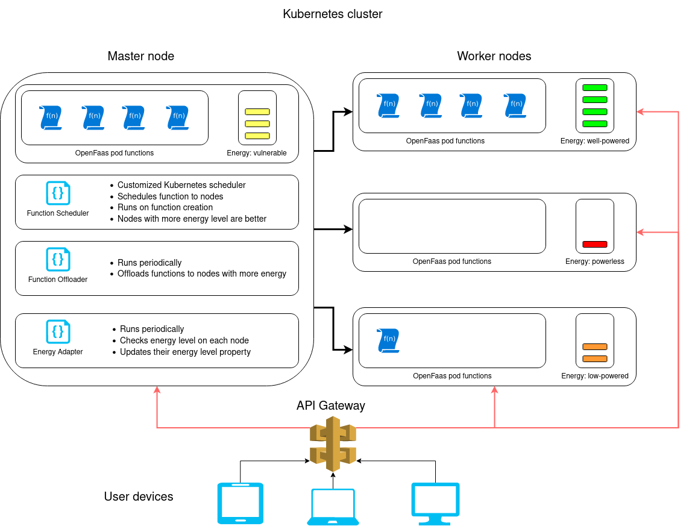

# Energy-aware K8S Function Scheduler on Serverless

## Introduction
An energy-aware custom <a href="https://github.com/kubernetes/kubernetes">Kubernetes</a> scheduler for Serverless environment with purpose of increasing the availability of the services. It's an academic project i've developed based on this conference paper: [Energy-Aware Resource Scheduling for Serverless Edge Computing](https://ieeexplore.ieee.org/document/9826101/). The main goal of this paper is to increment the availability of the services in a serverless edge environment with awareness of the energy levels of renewable energy nodes.


The project is implemented on <a href="https://github.com/kubernetes-sigs/scheduler-plugins">The Scheduling Framework</a> built by the K8S team and the functions are deployed on <a href="https://github.com/openfaas">OpenFaas</a> which is a serverless deployment tool. It does not fully implement the base paper mentioned but it is abstractly similar as its not implemented on real renewable node machines and also some detail might have been dropped.    
Although the title highlights the scheduling process but there are other components along it. The main purpose of this work is to increase the availability of nodes by offloading and scheduling pods to nodes with more energy level which can handle more energy required tasks with less down time.
Each component is documented with details

## System Architecture
<p align="center">
  
</p>

There are three main components on the master node each with a specific responsibility. Components are as follow:

### Energy Adapter    

The Energy Adapter is responsible for fetching the energy level of each node the physical devices, convert the values into discrete values and assign those values to each corresponding node. the energy adapter is being executed periodically, for example every one minute to have the system updates.   
Although this is the main idea behind the base paper but this project is implemented with more abstractions so there's no physical energy meter. The discrete values are generated randomly for each node. The energy levels are as follow:
- well powered: 75 to 100 percent energy
- vulnerable:   40 to 75 percent energy
- low powered:  15 to 40 percent energy
- powerless:    0 to 15 percent energy

These energy levels are being bound to every node using the pods labels. The key for the label is `energy-status`.
This component is placed in the <a href="https://github.com/faramarzQ/energy-aware-k8s-serverless-scheduler/tree/main/energy_adapter">energy_adapter</a> directory. On the first run of the plugin, it assigns new values to each node. on the later runs it switches the energy levels; `well-powered` and `low-powered` labels are switched and `vulnerable` and `powerles` labels too.

### Function Offloader

The Function Offloader component which is also being executed periodically is responsible to keeping the pods on nodes with higher energy levels. For each pod it checks if there is better nodes out there with higher energy levels and empty capacity to host the pod. If a better node found, the pod is being terminated so that the Deployment resource recreates it. This component is placed in the <a href="https://github.com/faramarzQ/energy-aware-k8s-serverless-scheduler/tree/main/function_offloader">function_offloader</a>.

### Function Scheduler

The main component of the system is The Scheduler Component with is called on the creation of each pod and finds the best node for hosting it. This component uses the scheduling framework so in order to understand it you need to take a look at <a href="https://kubernetes.io/docs/concepts/scheduling-eviction/scheduling-framework/">this documentation</a>. This scheduler only implements the Filter Plugin to filter the nodes to find the best node. This component is placed in the <a href="https://github.com/faramarzQ/energy-aware-k8s-serverless-scheduler/tree/main/function_scheduler">function_scheduler</a>.

## packages and models

There are two components used by the project, the cluster and the clientset.
The clientset creates an instance of the Kubernetes' Clientset module to communicate with the cluster. The cluster component has the overridden models of the Kubernetes Resources including Pod and Node. Each model is responsible for the logic of the corresponding domain like deleting pods of getting nodes' energy status. Packages are placed in the <a href="https://github.com/faramarzQ/energy-aware-k8s-serverless-scheduler/tree/main/pkg">pkg</a>.

## The Function
I've used a simple fibonacci function as the service provided to users which returns the fibonacci value of a given number. this function is highly cpu intensive for large numbers which can be a good small scale function for this project. The Deployment file of the project is placed inside the <a href="https://github.com/faramarzQ/energy-aware-k8s-serverless-scheduler/tree/main/function_deployment">function_deployment</a> directory.

## How Does It Work?
Well, First of all you need to have Minikube cluster and Kubectl install on your machine. for the serverless environment you also need to install OpenFaas on your cluster. I've linked some documentation for the installation process at the end of this documentation.     
After these steps, we need to inject the scheduler into kubernetes:

<br>

### Setting Up The Scheduler

In order for out scheduler to have access to kuberntes' APIs throughout the clientset library we should provide it with a config file. i've placed the config files inside `minikube_auth` directory. your's cluster config is different so do the following:
- Access the minikube's shell:

``` $ minikube ssh ```    
``` $ cd /etc/kubernetes ```
``` $ sudo cat admin.conf ```

This is your in_cluster config which we're going to use to access the API. paste it inside `minikube_auth/in_cluster_config` file.

- Now you should compile the scheduler's code inside the `function_scheduler` directory using this command:   

``` $ Go build function_scheduler/main.go```

- You need to mount the function_scheduler directory into minikube, but first you should make a directory inside it so run this command inside kube's shell to create a directory for your scheduler:

``` $ sudo mkdir /home/custom_scheduler ```

- keep this shell open for later. Open another shell on this project's directory and run this to mount the scheduler into Kubernetes:

``` $ minikube mount ./function_scheduler:/home/custom_scheduler ```

Don't close this shell neither. Now any changes to the function_scheduler's dirctory files is being applied to /home/scheduler directory.

- Now we need to execute the custom scheduler's plugin using this:

``` $ sudo CONFIG_DIR=../minikube_auth/config ./main --authentication-kubeconfig=/etc/kubernetes/scheduler.conf --authorization-kubeconfig=/etc/kubernetes/scheduler.conf --config=scheduler-config.yaml --secure-port=10260 ```

your scheduler is good now listening for new pods.

<br>

### Apply The Function Deployment

Run this command to apply the deployment's yaml file into your cluster:

``` $ Kubectl apply -f function_deployment/fibonacci.yml ```

You can change the number of replication of the function in the deployment for better testing experience.

<br>

### Run The Energy Adapter

before running the energy adapter you need to copy paste the minikube's cluster config used by the kubectl into the project. We gotta do some copy-paste stuff so :

``` $ cat ~/.minikube/profiles/minikube/client.crt > ./minikube_auth/profiles/client.crt ```    
``` $ cat ~/.minikube/.ca.crt > ./minikube_auth/profiles/ca.crt ```    
``` $ cat ~/.minikube/profiles/minikube/client.key > ./minikube_auth/profiles/client.key ```   

Now the Energy adapter and function offloader modules can connect to the cluster from outside.    
You can run the adapter once using this command or periodically every 20 seconds using the later one:    

``` $ go run energy_adapter/main.go ```
``` $ watch -n 20 go run energy_adapter/main.go ```

<br>

### Run The Function Offloader

Run the following to offload the function which can be placed on better nodes:

``` $ go run function_offloader/main.go ```
``` $ watch -n 30 go run function_offloader/main.go ```


The Energy Adapter updates the energy level of nodes every n seconds, the offloader offloads the function every m seconds based on the energy level and the scheduler runs on every pod creation.


## Usefull Links

[How to Create Serverless Functions with OpenFaaS in 17 Steps](https://hackernoon.com/how-to-create-serverless-functions-with-openfaas-in-17-steps-u21l3y7m)    
[Customizing the Kubernetes Scheduler](https://www.sobyte.net/post/2021-12/custom-k8s-scheduler/)     
[Kubernetes Scheduling Framework](https://kubernetes.io/docs/concepts/scheduling-eviction/scheduling-framework/)
[Kubernetes Scheduling Framework on Github](https://github.com/kubernetes/enhancements/blob/master/keps/sig-scheduling/624-scheduling-framework/README.md)
[Kubernetes Scheduling Plugins](https://github.com/kubernetes-sigs/scheduler-plugins)
[Kubernetes Scheduler Introduction](https://www.sobyte.net/post/2021-12/custom-k8s-scheduler/)

<br>
<br>
<br>


### <i>"Developing this project made my mouth paved!!"</i>
